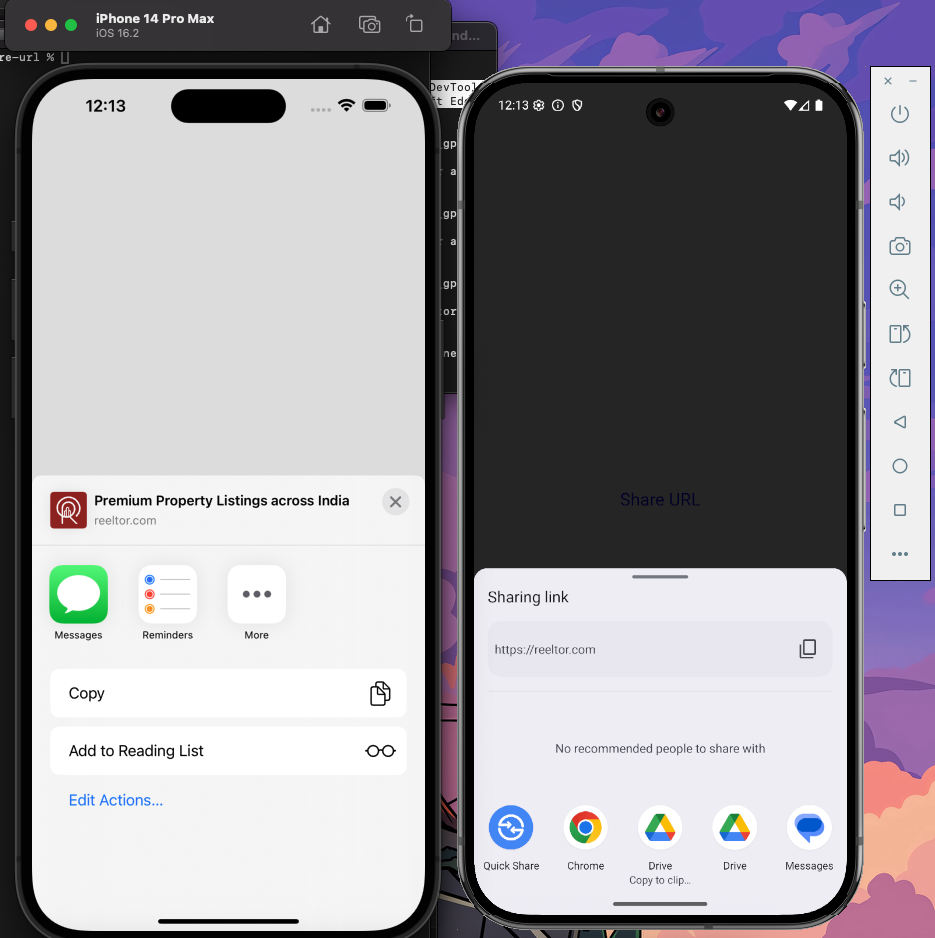

# rn-share-url

`rn-share-url` is a React Native TurboModule that allows you to share a URL using the native iOS and Android share dialogs.

## Installation

```sh
npm install rn-share-url
```

or

```sh
yarn add rn-share-url
```

> **Note**: This module uses [TurboModules](https://reactnative.dev/docs/the-new-architecture-intro), so make sure your app is configured for the new architecture.

## Usage

```ts
import ShareUrl from 'rn-share-url';

// Share a URL
ShareUrl.shareUrl('https://example.com');
```

## Example

You can trigger sharing like this:

```ts
import { Button } from 'react-native';
import ShareUrl from 'rn-share-url';

export default function App() {
  return (
    <Button
      title="Share Link"
      onPress={() => ShareUrl.shareUrl('https://yourdomain.com')}
    />
  );
}
```



## Development

This library was bootstrapped with [create-react-native-library](https://github.com/callstack/react-native-builder-bob).

To contribute, see the [contributing guide](CONTRIBUTING.md).

## License

MIT

```

---

## 📌 Notes:
- Updated function name to `shareUrl`.
- Removed `multiply`, which appears to be leftover from the template.
- Added example usage with a real-world scenario.
- Added a note about TurboModules.

Let me know if you want to include troubleshooting steps (e.g. for TurboModule setup or codegen).
```
